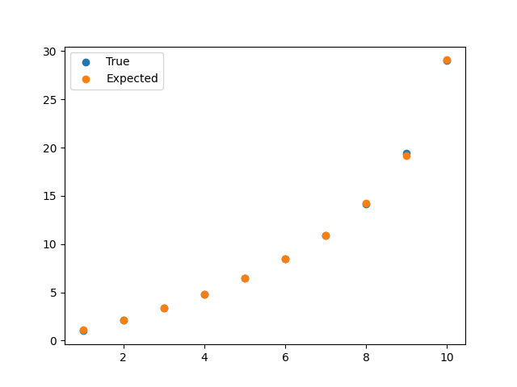

The following question was inspired by Column 12 "A Sample Problem" from the book "Programming Pearls" by Jon Bentley. It's about randomly sampling $m$ integers from $\\{1,\dots,n\\}$, where $n$ is typically much larger than $m$. The first proposed solution runs in $\mathcal O(n)$ time, but the author also proposes a second solution. It works by uniformly sampling from $\\{1,\dots,n\\}$, adding the new integer to a set, and returning the set once it reaches a size of $m$.
Depending on how small $m$ is compared to $n$, the second solution might be faster: for small $m$ it works in $\mathcal O(m \log m)$ time. I was interested in the question of how the runtime changes, when $m$ becomes closer to $n$. Clearly, if we want to sample $90$ numbers from, say, $\\{1,\dots,100\\}$, we will end up with quite a lot of repeating numbers toward the end.

To answer this, let's define a few random variables:
* $X$ is the number of iterations,
* $Y$ is the number of repeat draws; note that $Y = X - m$,
* Let $Y_i$ be $1$, if the $i$-th draw was a repeat draw and the current set size is at most $m$. Otherwise it is $0$. Note that $Y = \sum_{i=1}^\infty Y_i$,
* To add to the superscript confusion, let's also define partial sums $Y^{(i)} = \sum_{k=1}^{i} Y_k$.

Our goal is to compute $\mathbb E[X] = m + \mathbb E[\sum_{k=1}^\infty Y_i] = m + \sum_{k=1}^\infty \mathbb E[Y_i]$.

Let's denote by $C_i \coloneqq i - Y^{(i)}$ the size of the set at the end of iteration $i$.
Then, the probability of a repeat draw in the $i$'th iteration is $C_{i-1}/n$. Because we cannot make the probability of a random variable depend on another random variable directly, we make use of the *law of total probability*.

$$\mathbb E[Y_i] = P(Y_i = 1) = \sum_{k=0}^{i-1} P(Y_i = 1 \mid Y^{(i-1)} = k) P(Y^{(i-1)} = k).$$

For the conditional probability, we have
$$P(Y_i = 1 \mid Y^{(i-1)} = k) = \frac{(i-1)-k}{n} P(C_{i-1} < m),$$
where the second term is due to the fact that $Y_i$ should only be $1$, if the current size of the set is smaller than $m$. This can also be rewritten as $P(Y^{(i-1)} \geq i-m)$.

For the probability of the partial sums, we get:
$$P(Y^{(i)} = k) = P(Y^{(i-1)} = k) P(Y_i = 0 \mid Y^{(i-1)} = k) + P(Y^{(i-1)} = k-1) P(Y_i = 1 \mid Y^{(i-1)} = k-1).$$

This formulation lends itself to a nice recursive algorithm that approximates $\mathbb E[X]$. I simply cap the computation at $8n$, which seems to work well.

```python
import numpy as np

def f(m, n, i, k):
    """
    Helper function that omputes P(Y_i = 1 | Y^(i-1) = k).
    """
    return (i - k) / n * (k > i - m)

def EX_approx(m, n):
    if m == 1:
        return 1

    s = 8*n  # Cut-off for the infinite sum.
    
    P = np.zeros((s,s))
    Y = np.zeros(s)
    Y[1] = 1 / n
    P[1][0] = (n-1) / n
    P[1][1] = 1 / n
    for i in range(2,s):
        # Inner loop only until i, because the values can't be any larger.
        for k in range(i):
            Y[i] += (i-k) / n * P[i-1][k] * (k > i-m)
        for k in range(i):
            p1 = f(m, n, i, k)
            p2 = f(m, n, i, k-1)
            P[i][k] = P[i-1][k] * (1 - p1) + P[i-1][k-1] * p2
    
    return m + Y.sum()
```

Note that I used 1-indexing in the equation but 0-indexing in the code. So, for example, `Y[1]` corresponds to $\mathbb E[Y_2]$ and `P[1][0]` is $P(Y^{(2)} = 0)$.

Below are the results for $n = 10$, rounded to two decimals.
$m$|Expected iterations
--|-----
1 | 1.00
2 | 2.11
3 | 3.36
4 | 4.78
5 | 6.44
6 | 8.43
7 | 10.92
8 | 14.23
9 | 19.19
10 | 29.08

I ran an experiment to see how well it holds up in real experiments. Here are the results:



Looks correct!

As I mentioned, I cap the computation after $8n$ steps. I'm not sure what makes this a good stopping point and whether this holds up for larger values of $n$. This could be something to investigate.

It would be cool to have an analytic expression for this expectation in terms of $m$ and $n$, but I wouldn't expect this to look pretty, if possible at all. If one wanted to try this, having a look at [generating functions](https://en.wikipedia.org/wiki/Generating_function) might be a good start. But maybe a closed-form expression is already known and I just didn't find it! If anybody knows, let me know.